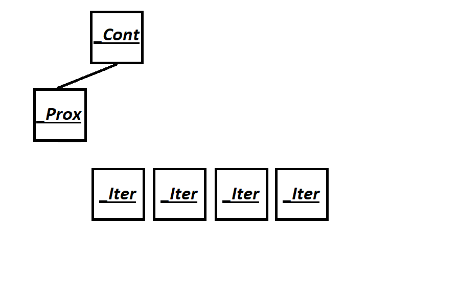
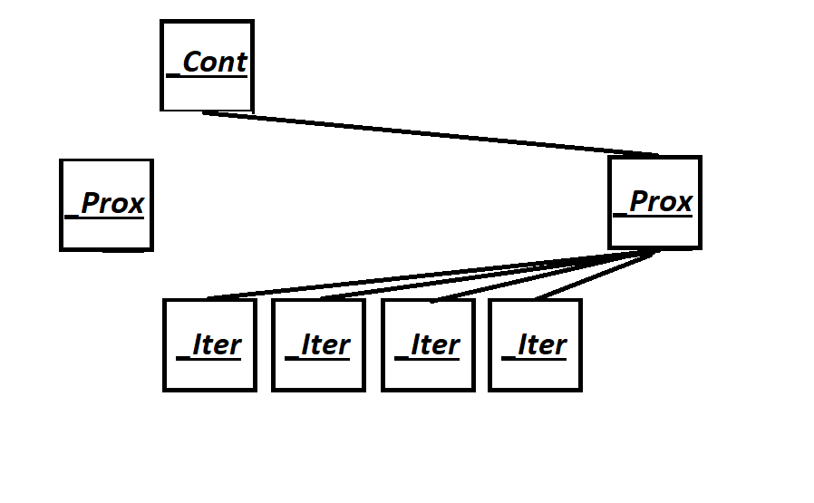
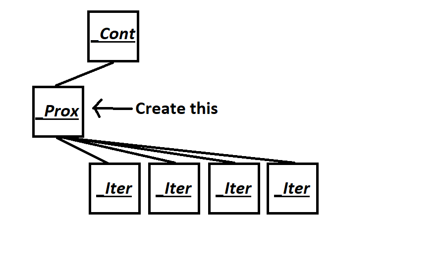
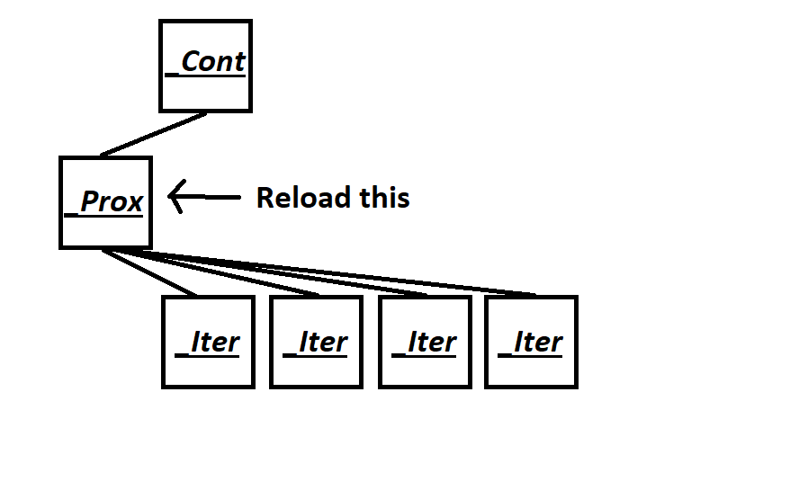

# _Container_base12

## **Code:** [Vector/ymemory.h](Vector/ymemory.h#L85)

The _Container_base12 constructor by default creates a container object.

The ```_Orphan_all()``` function severs all connections with iterators. For example, if we have a container with multiple iterators, this function "detaches" the iterators from the container to avoid incorrect access to the container's data.



The ```_Swap_proxy_and_iter(_Container_base12& _Cont) ```function swaps the proxies of the current container with the proxies of another container _Cont. This allows containers to exchange information about their iterators if necessary, for example, when merging or splitting containers.



The ```_Alloc_Proxy(_Alloc&& _Al)``` function creates a proxy for the container using memory allocated by the allocator _Al. This allows the container to manage its iterators and provide them with access to the container's data.



The ```_Reload_Proxy(Alloc&& Old_Al, Alloc&& _New_Al)``` function recreates a proxy for the container using the new allocator _New_Al, and also releases resources associated with the previous proxy using the Old_Al allocator. This can be useful, for example, when changing the container's allocator.



The ```_Orphan_all_locked()``` and ```_Swap_proxy_and_iter_locked()``` functions perform similar operations but in a protected area using the _LOCK_DEBUG lock. This ensures the safety of operations in multithreaded access to the container and its iterators.